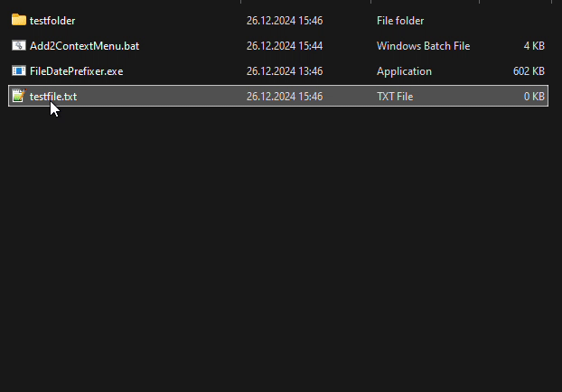
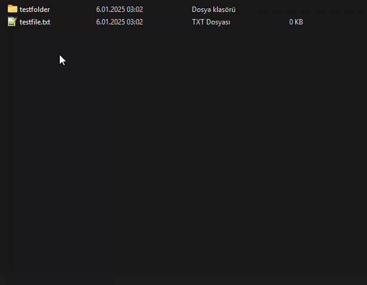

# FileDatePrefixer

[English](README.md) | [Türkçe](README-tr.md)

**FileDatePrefixer, Windows'ta dosya ve klasör adlarının başına sıralanabilir tarih öneki ekleyen, mevcut öneki güncelleyen veya kaldıran küçük bir yardımcı programdır.**

Önek biçimi:

```text
YYYYMMDDHHMM <orijinal ad>
```

Örneğin:

```text
rapor.pdf
    │
    ▼
202501052345 rapor.pdf
```

Zaman bilgisi **mevcut yerel sistem saatinden** veya seçilen dosya/klasörün **son değiştirilme zamanından** alınabilir.

## Özellikler

- Hem dosyalar hem klasörlerle çalışır.
- **Windows Explorer üzerinden toplu işlem** destekler: birden fazla dosya/klasör seçilip sağ tık menüsündeki komut çalıştırılarak tüm seçimde tarih öneki eklenebilir, güncellenebilir veya kaldırılabilir. Windows Explorer shell komutunu seçili öğeler için çağırır; her FileDatePrefixer process'i tek bir yolu işler.
- Yerel sistem saatini kullanarak `YYYYMMDDHHMM` öneki ekler.
- İstenirse seçilen öğenin son değiştirilme zamanını kullanır.
- Mevcut tarih önekini algılar ve ikinci bir tarih eklemek yerine **mevcut öneki değiştirir**.
- Mevcut tarih önekini kaldırabilir.
- `std::filesystem::rename()` kullanır; dosya içeriğini yeniden yazmaz.
- Başarılı normal işlem sırasında kullanıcı arayüzü açmayan yerel Windows uygulamasıdır.
- Win32 ve x64 Visual Studio derleme yapılandırmalarını içerir.
- MIT lisanslıdır.

## Kullanım Gösterimi

### Doğrudan / Sürükle-Bırak Kullanımı



Bir dosya veya klasör executable üzerine sürüklenip bırakıldığında seçilen yol programa ilk komut satırı argümanı olarak gelir. İkinci seçenek verilmezse uygulama mevcut sistem zamanını kullanır.

### Windows Explorer Sağ Tık Menüsü Kullanımı



Proje, Windows Explorer üzerinden **Prefix Date** ve **Prefix Date (File/Folder Time)** gibi shell komutlarıyla çağrılabilecek şekilde tasarlanmıştır.

## Komut Satırı Arayüzü

```text
FileDatePrefixer.exe <yol> [seçenek]
```

### Mevcut Sistem Zamanını Kullanma

```text
FileDatePrefixer.exe "C:\yol\rapor.pdf"
```

veya açıkça:

```text
FileDatePrefixer.exe "C:\yol\rapor.pdf" --use-system-time
```

Sonuç:

```text
rapor.pdf
→ 202501052345 rapor.pdf
```

Ad zaten geçerli 12 haneli bir önek ve ardından boşlukla başlıyorsa mevcut önek değiştirilir:

```text
202412010830 rapor.pdf
→ 202501052345 rapor.pdf
```

### Dosya/Klasör Değiştirilme Zamanını Kullanma

```text
FileDatePrefixer.exe "C:\yol\rapor.pdf" --use-file-time
```

Önek, `std::filesystem::last_write_time()` değerinin yerel sistem saati gösterimine dönüştürülmesiyle oluşturulur.

### Tarih Önekini Kaldırma

```text
FileDatePrefixer.exe "C:\yol\202501052345 rapor.pdf" --remove-date
```

Sonuç:

```text
202501052345 rapor.pdf
→ rapor.pdf
```

Dosya adı beklenen tarih önekiyle başlamıyorsa kaldırma işlemi ad metnini değiştirmez ve program yine rename işlemini gerçekleştirmeyi dener.

## Önek Algılama

Uygulama mevcut öneki şu düzenli ifadeyle algılar:

```regex
^\d{8}\d{4}\s
```

Pratikte dosya adının:

- tam **12 rakamla** başlaması;
- ardından bir boşluk karakteri gelmesi

gerekir.

Kod bu 12 haneyi yapısal olarak `YYYYMMDDHHMM` biçiminde kullanır; ancak düzenli ifade ay, gün, saat veya dakika değerlerinin gerçek bir tarih oluşturup oluşturmadığını doğrulamaz.

Örnekler:

```text
202501052345 rapor.pdf    algılanır
202501052345_rapor.pdf    algılanmaz
20250105 rapor.pdf        algılanmaz
rapor 202501052345.pdf    algılanmaz
```

## Çalışma Akışı

```text
Windows komut satırı
        │
        ▼
CommandLineToArgvW()
        │
        ├── yol yok ─────────────► hata MessageBox
        │
        ▼
yolun varlığını doğrula
        │
        ├── bulunamadı ──────────► hata MessageBox
        │
        ▼
seçeneği incele
        │
        ├── --remove-date
        │       │
        │       └──► eşleşen öneki kaldır
        │
        ├── --use-file-time
        │       │
        │       └──► last_write_time() oku
        │
        └── varsayılan / --use-system-time
                │
                └──► yerel sistem zamanını oku
                         │
                         ▼
                    hedef adı oluştur
                         │
                         ▼
                std::filesystem::rename()
```

Dosya sistemi istisnaları yakalanır ve Windows mesaj kutusunda gösterilir.

## Tarih Oluşturma

### Mevcut Zaman

`getCurrentDate()` şunları kullanır:

- `std::chrono::system_clock::now()`;
- `std::chrono::system_clock::to_time_t()`;
- `localtime_s()`.

Sonuç ayraç olmadan şu biçimde üretilir:

```text
YYYY MM DD HH MM
 │   │  │  │  └─ dakika
 │   │  │  └──── saat
 │   │  └─────── gün
 │   └────────── ay
 └────────────── yıl
```

### Dosyanın Son Değiştirilme Zamanı

`getFileModificationDate()`, `std::filesystem::last_write_time()` değerini okur, dosya sistemi saatini `system_clock` zaman noktasına dönüştürür ve aynı yerel saat biçimiyle formatlar.

## Yeniden Adlandırma Davranışı

Program yalnızca seçilen yolun dosya/klasör adını değiştirir. Üst klasör aynı kalır.

```text
C:\Projeler\rapor.pdf
          │
          ▼
C:\Projeler\202501052345 rapor.pdf
```

Gerçek dosya sistemi işlemi:

```cpp
fs::rename(filePath, newFilePath);
```

Yani program dosya içeriğini kopyalayıp orijinali silmek yerine aynı üst dizin içinde yeniden adlandırma/taşıma işlemi gerçekleştirir.

Normal dosya sistemi kısıtlamaları geçerlidir. Yetki eksikliği, geçersiz hedef, aynı adda başka bir öğenin bulunması, kilitli kaynak veya başka dosya sistemi koşulları rename işlemini başarısız kılabilir.

## Hata Yönetimi

Executable hataları Windows mesaj kutularıyla bildirir.

| Durum | Davranış |
|---|---|
| Hedef yol verilmemiş | Hata mesajı, çıkış kodu 1 |
| Hedef yol mevcut değil | Hata mesajı, çıkış kodu 1 |
| `std::filesystem` işlemi exception üretir | Exception metni gösterilir, çıkış kodu 1 |
| İşlem başarılı | Çıkış kodu 0 |

Kaynak kodda başarılı işlem sonrasında gösterilen bir bildirim penceresi bulunmaz.

## Derleme

Depoda Visual Studio solution dosyası bulunur:

```text
FileDatePrefixer.sln
```

Visual C++ proje dosyası:

```text
FileDatePrefixer/FileDatePrefixer.vcxproj
```

### Araç Zinciri

Güncel proje dosyasında:

- Visual Studio C++ proje biçimi sürüm 17;
- MSVC platform toolset `v143`;
- Windows SDK hedefi `10.0`;
- x64 yapılandırmaları için açıkça C++17;
- Unicode karakter seti;
- Win32 ve x64 için Debug/Release yapılandırmaları

tanımlıdır.

**Release x64** yapılandırması Windows subsystem kullanır; bu nedenle normal release executable çalışırken konsol penceresi açmaz.

### Visual Studio ile Derleme

1. `FileDatePrefixer.sln` dosyasını açın.
2. İstenen yapılandırmayı, normal kullanım için tercihen `Release | x64`, seçin.
3. `FileDatePrefixer` projesini derleyin.
4. Oluşan `FileDatePrefixer.exe` dosyasını doğrudan kullanın veya Windows Explorer shell komutuna bağlayın.

## Sürümler

Depoda paketlenmiş release'ler bulunmaktadır. Güncel yayımlanmış sürüm **v1.0.4**'tür ve release notlarına göre bu sürümde tarih önekini kaldırma özelliği eklenmiştir.

[En son sürümü indir](https://github.com/sezgynus/file-date-prefixer/releases/latest)

Release paketi, Windows Explorer sağ tık menüsü entegrasyonunu kurmak ve kaldırmak için kullanılan dağıtım scriptlerini içerir.

## Windows Explorer Entegrasyonu

Executable seçilen öğenin yolunu ilk argüman olarak aldığı ve etkileşimli bir arayüz gerektirmeden işlemi gerçekleştirdiği için Windows shell verb'leriyle kullanılmaya uygundur.

Tipik shell komutları doğrudan şu işlemlere karşılık gelir:

```text
Prefix Date
    FileDatePrefixer.exe "%1" --use-system-time

Prefix Date (File/Folder Time)
    FileDatePrefixer.exe "%1" --use-file-time

Remove Date Prefix
    FileDatePrefixer.exe "%1" --remove-date
```

Paketlenmiş release, bu komutları Windows Explorer'a kaydetmek ve kaldırmak için gerekli kurulum/kaldırma scriptlerini sağlar.

## Uygulama Notları

Uygulamanın giriş noktası `WinMain`'dir. Komut satırı ayrıştırması `GetCommandLineW()` ve `CommandLineToArgvW()` ile yapılır; böylece Windows yolları wide string olarak alınır.

Seçilen yol `std::filesystem::path` içinde tutulur. Ancak dosya adı işleme yardımcı fonksiyonları `path.filename()` değerini `std::regex` uygulamadan önce `std::string`'e dönüştürür. Bu nedenle aktif Windows dar karakter kodlamasının dışındaki dosya adları dikkatle test edilmelidir; mevcut uygulama baştan sona tamamen wide-character bir dosya adı işleme yolu değildir.

Kod ikinci argümandaki herhangi bir değeri zaman seçeneği olarak kabul eder. Yalnızca `--use-system-time` ve `--use-file-time` gerçek bir zaman değeri atar. Desteklenmeyen seçenek rename hedefi oluşturulmadan önce açıkça reddedilmez; bu nedenle yalnızca belgelenen seçenekler kullanılmalıdır.

## Kaynak Dosya Haritası

| Dosya | Görev |
|---|---|
| `FileDatePrefixer/FileDatePrefixer.cpp` | Komut satırı ayrıştırma, tarih üretme, önek algılama/kaldırma ve dosya sistemi rename işlemi |
| `FileDatePrefixer/FileDatePrefixer.vcxproj` | Visual Studio derleme yapılandırmaları ve araç zinciri ayarları |
| `FileDatePrefixer/Resources.rc` | Windows resource scripti |
| `FileDatePrefixer/icon.ico` | Uygulama ikonu |
| `Contents/Direct.gif` | Doğrudan/sürükle-bırak kullanım gösterimi |
| `Contents/Context.gif` | Explorer sağ tık menüsü kullanım gösterimi |
| `LICENSE` | MIT lisansı |

## Depo Yapısı

```text
file-date-prefixer/
├── .github/
│   └── workflows/
│       └── sign-commits.yml
├── Contents/
│   ├── Context.gif
│   └── Direct.gif
├── FileDatePrefixer/
│   ├── FileDatePrefixer.cpp
│   ├── FileDatePrefixer.vcxproj
│   ├── FileDatePrefixer.vcxproj.filters
│   ├── Resources.rc
│   ├── icon.ico
│   └── resources.h
├── FileDatePrefixer.sln
├── LICENSE
├── README.md
└── README-tr.md
```

## Lisans

FileDatePrefixer [MIT Lisansı](LICENSE) altında dağıtılmaktadır.

Telif hakkı © 2025 Sezgin AÇIKGÖZ.
