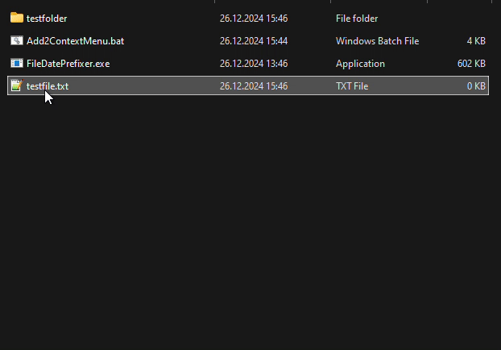
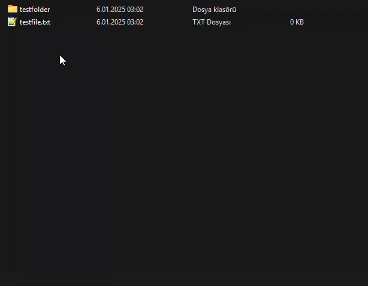

# FileDatePrefixer

**FileDatePrefixer**, Windows'ta dosya veya klasör isimlerinin başına otomatik olarak tarih eklemenize olanak tanıyan kullanışlı bir araçtır. Sağ tık menüsüne entegre edilen bu araç sayesinde, dosya ve klasörlerinizi organize etmek çok daha kolay hale gelir.

---
## Support | Destek Ol

### English
If you find my work helpful or inspiring, consider supporting me on Buy Me a Coffee! Your contributions help me keep building and sharing projects.

<a href="https://buymeacoffee.com/sezgin5574z" target="_blank">
    
</a>

---

### Türkçe
Eğer çalışmalarımı faydalı veya ilham verici buluyorsanız, Buy Me a Coffee üzerinden bana destek olabilirsiniz! Katkılarınız, projeler üretmeye ve paylaşmaya devam etmemi sağlıyor.

<a href="https://buymeacoffee.com/sezgin5574z" target="_blank">
    
</a>


---
## Özellikler

- **Tarih Prefiksi Ekleme**: Dosya ve klasör isimlerinin başına otomatik olarak mevcut tarihi ekler.
- **Windows Sağ Tık Menüsü Entegrasyonu**: "Prefix Date" seçeneği doğrudan sağ tık menüsüne eklenir.
- **Hızlı ve Hafif**: Minimal sistem kaynağı tüketimiyle hızlı çalışır.
- **Yönetici İzinleri Gerekliliği**: Sistem dosyalarına müdahale eden işlemler için güvenlik odaklı tasarım.
- **Açık Kaynak**: İhtiyaçlarınıza göre özelleştirilebilir.

---

## Kurulum

### 1. Hazır Binary ile Kurulum
1. **[Son Sürümü İndirin](https://github.com/sezgynus/file-date-prefixer/releases/latest)** (GitHub'dan).
2. `Add2ContextMenu.bat` dosyasını **yönetici olarak** çalıştırın.
3. İşlem tamamlandığında araç sağ tık menüsüne entegre edilmiş olacaktır.

### 2. Kaynak Koddan Derleme
1. Bu projeyi klonlayın:
   ```bash
   git clone https://github.com/sezgynus/file-date-prefixer.git
   ```
2. **FileDatePrefixer** projesini derleyin (örneğin, Visual Studio kullanarak).
3. Derlenmiş binary dosyasını (`FileDatePrefixer.exe`) kullanarak `Add2ContextMenu.bat` ile kurulumu gerçekleştirin.

---

## Kullanım
### 1. Sürükle ve Bırak Yöntemi

1. Windows dosya gezgininde tarih prefixi eklemek istediğiniz dosya veya klasörü programın üzerine sürükleyip bırakın.
2. Dosya veya klasörün isminin başına otomatik olarak tarih eklenecektir. Örneğin:
   - `document.txt` → `202501052345 document.txt`
   - `project_folder` → `202501052345 project_folder`

### 2. Sağ Tık Menüsü Yöntemi

1. Windows dosya gezgininde herhangi bir dosya veya klasöre **sağ tıklayın**.
2. Açılan menüden **Prefix Date** yada **Prefix Date(File/Folder Time)** seçeneğini seçin.
3. Seçilen dosya/klasörün isminin başına otomatik olarak tarih eklenecektir. Örneğin:
   - `document.txt` → `202501052345 document.txt`
   - `project_folder` → `202501052345 project_folder`

---

## Kaldırma

1. **RemoveFromContextMenu.bat** dosyasını **yönetici olarak** çalıştırın.
2. Bu işlem, aracı sağ tık menüsünden kaldırır ve ilgili registry kayıtlarını temizler.

---

## Teknik Detaylar

- **Programlama Dili**: C++17
- **Platform**: Windows
- **Minimum Desteklenen Windows Sürümü**: Windows 10
- **Registry Kullanımı**:
  - Sağ tık menüsü için `HKEY_CLASSES_ROOT` altındaki registry anahtarları kullanılır.
  - İlgili değerler araç kurulumunda otomatik olarak eklenir.

---

## Katkıda Bulunma

Katkıda bulunmak için aşağıdaki adımları izleyin:
1. Bu projeyi fork'layın.
2. Yeni bir dal oluşturun: `git checkout -b feature/my-feature`
3. Değişikliklerinizi commit edin: `git commit -m "Add my feature"`
4. Dalınızı push edin: `git push origin feature/my-feature`
5. Bir **Pull Request** gönderin.

---

## İletişim

Herhangi bir sorunuz, öneriniz veya geri bildiriminiz varsa benimle iletişime geçebilirsiniz:

- **İsim**: Sezgin AÇIKGÖZ  
- **Email**: [sezginacikgoz@mail.com](mailto:sezginacikgoz@mail.com)

---

## Lisans

Bu proje [MIT Lisansı](LICENSE) altında lisanslanmıştır. Daha fazla bilgi için LICENSE dosyasını inceleyin.
